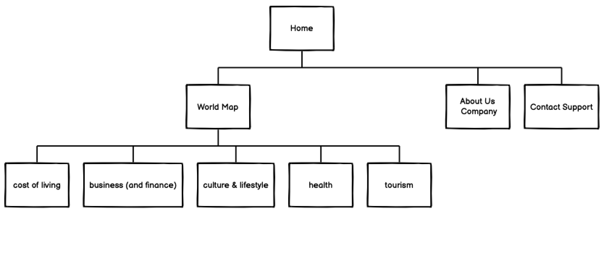

<h1 align="center">Mikedolding Milestone Project 2</h1>

- [Webzinoy!](#Webzinoy!)
  - [Overview](#overview)
  - [User Experience (UX)](#User-Experience)
  - [Design](#design)
  - [Data Model](#data-model)
  - [Testing](#testing)
    - [Known Bugs: CORS error](#known-bugs)
    - [Validator Testing](#validator-testing)
  - [Deployment](#deployment)
  - [Technologies Used](#technologies-used)
    - [Languages](#languages-used)
    - [Frameworks, Libraries & Programs Used](#frameworks-libraries--programs-used)
    - [GitHub Pages](#github-pages)
  - [Credits & Attributions](#credits)
  - [Acknowledgements](#acknowledgements)

## Webzinoy! [View the live project here.](https://mikeydolding.github.io/milestone-project-two/)

## Overview

Webzinoy! allows users to get news information from countries around the world.
The website has a number of features, including:

- A contact site owner email page
- A javascript code to consume news API
- An 'About Us' page with carousel of images

## User Experience (UX)

- #### First Time Visitor Goals

  1. As a First Time Visitor, I want to easily understand the main purpose of the site and learn more about the organisation.

     1. Upon entering the site, users are automatically greeted with a clean and easily readable navigation bar to go to the page of their choice. Underneath there is a Hero Image with Text and a "Learn More" Call to action button.
     2. The main points are made immediately with the hero image
     3. The user has two options, click the call to action buttons or scroll down, both of which will lead to the same place, to learn more about the organisation.

  2. As a First Time Visitor, I want to be able to easily be able to navigate throughout the site to find content.

     1. The site has been designed to be fluid and never to entrap the user. At the top of each page there is a clean navigation bar, each link describes what the page they will end up at clearly.
     2. At the bottom of the first 3 pages there is a redirection call to action to ensure the user always has somewhere to go and doesn't feel trapped as they get to the bottom of the page.
     3. On the Contact Us Page, after a form response is submitted, the page refreshes and the user is brought to the top of the page where the navigation bar is.

- #### Returning Visitor Goals

  1. As a Returning Visitor, I want to find the new news items from around the world.

     1. These are updated whenever the page is reloaded.

  2. As a Returning Visitor, I want to find the best way to get in contact with the organisation with any questions I may have.

     1. The navigation bar clearly highlights the "Contact Us" Page.
     2. Here they can fill out the contact us form.
     3. The email button is set up to automatically send user information and messages to email account of site owner


- #### Frequent User Goals

  1. As a Returning Visitor, I want to find the new news items from around the world.

     1. These are updated whenever the page is reloaded.


### Design

- #### Colour Scheme

  - The two main colours used are Code Insititue cyan, blue, white, black.

- #### Typography

  - The Roboto font is the main font used throughout the whole website with Sans Serif as the fallback font in case for any reason the font isn't being imported into the site correctly. Roboto is a clean font used frequently in programming, so it is both attractive and appropriate.

- #### Imagery
  - Imagery is important. The large, background hero image is designed to be striking and catch the user's attention. It also has a modern, energetic aesthetic.

### Features

- Responsive on all device sizes

- Interactive elements

### Wireframes

    -   Sitemap -



    -   Home Page Wireframe  -


    -   Contact Us Page Wireframe - [View](https://github.com/)

## Technologies Used

### Languages Used

- [HTML5](https://en.wikipedia.org/wiki/HTML5)
- [CSS3](https://en.wikipedia.org/wiki/Cascading_Style_Sheets)
- [Javascript](https://en.wikipedia.org/wiki/JavaScript)
- [jquery-3.6.4.min.js](https://code.jquery.com/)

### Frameworks, Libraries & Programs Used

1. [Bootstrap 5.1:](https://getbootstrap.com/docs/5.1/)
   - Bootstrap was used to assist with the responsiveness and styling of the website.
2. [Google Fonts:](https://fonts.google.com/)
   - Google fonts were used to import the 'Titillium Web' font into the style.css file which is used on all pages throughout the project.
3. [Font Awesome:](https://fontawesome.com/)
   - Font Awesome was used on all pages throughout the website to add icons for aesthetic and UX purposes.
4. [jQuery:](https://jquery.com/)
   - jQuery came with Bootstrap to make the navbar responsive but was also used for the smooth scroll function in JavaScript.
5. [Git](https://git-scm.com/)
   - Git was used for version control by utilizing the Gitpod terminal to commit to Git and Push to GitHub.
6. [GitHub:](https://github.com/)
   - GitHub is used to store the projects code after being pushed from Git.
7. [Gimp:](https://www.gimp.com
   - Photoshop was used to create the logo, resizing images and editing photos for the website.
8. [Balsamiq:](https://balsamiq.com/)
   - Balsamiq was used to create the [wireframes](https://github.com/) during the design process.
9. [smtp.elasticemail.com](https://smtpjs.com/v3/smtp.js)
   - To send email from Javascript
10. [Newsdata.io API](https://newsdata.io/search-news)

- To fetch news content from arount the world

### Testing

In testing the application a number of bugs were discovered:

- The Website was tested on Google Chrome, Internet Explorer, Microsoft Edge and Safari browsers.
- The website was viewed on a variety of devices such as Desktop, Laptop, iPhone7, iPhone 8 & iPhoneX.
- A large amount of testing was done to ensure that all pages were linking correctly.
- Friends and family members were asked to review the site and documentation to point out any bugs and/or user experience issues.

- Used VS code Live Preview extension to hosts a local server and view HTML site

## Validator Testing

The W3C Markup Validator and W3C CSS Validator Services were used to validate every page of the project to ensure there were no syntax errors in the project.

- [W3C Markup Validator](https://jigsaw.w3.org/css-validator/#validate_by_input) - [Results](https://github.com/)
- [W3C CSS Validator](https://jigsaw.w3.org/css-validator/#validate_by_input) - [Results](https://github.com/)

### Known Bugs: CORS error

- When updating code on VS code, the website will automatically reload and fetch content from API <https://newsdata.io/search-news> too many times (main.js fetchNewsDefault() and cause an CORS error.

**Fix**

- One fix is to disable the fetchNewsDefault() function in main.js to prevent fetch requests to the API service provider which cause the API service provider to block the website.

### Further Testing

- The Website was tested on Mozilla Firefox and Safari browsers.
- The website was viewed on a variety of devices such as Desktop, Laptop, Android mobile, iPhone7.
- An amount of testing was done to ensure that all pages were linking correctly.
- Friends were asked to review the site and documentation to point out any bugs and/or user experience issues.

## Deployment

- The site was last deployed to the github-pages environment by the pages build and deployment workflow.

- The site is live at <https://mikeydolding.github.io/milestone-project-two/>

- In further development, an independant dedicated API and database of news content will be built for the website.

### GitHub Pages

The project was deployed to GitHub Pages using the following steps...

1. Log in to GitHub and locate the [GitHub Repository](https://github.com/)
2. At the top of the Repository (not top of page), locate the "Settings" Button on the menu.
   - Alternatively Click [Here](https://raw.githubusercontent.com/) for a GIF demonstrating the process starting from Step 2.
3. Scroll down the Settings page until you locate the "GitHub Pages" Section.
4. Under "Source", click the dropdown called "None" and select "Master Branch".
5. The page will automatically refresh.
6. Scroll back down through the page to locate the now published site [link](https://github.com) in the "GitHub Pages" section.

### Forking the GitHub Repository

By forking the GitHub Repository we make a copy of the original repository on our GitHub account to view and/or make changes without affecting the original repository by using the following steps...

1. Log in to GitHub and locate the [GitHub Repository](https://github.com/)
2. At the top of the Repository (not top of page) just above the "Settings" Button on the menu, locate the "Fork" Button.
3. You should now have a copy of the original repository in your GitHub account.

### Making a Local Clone

1. Log in to GitHub and locate the [GitHub Repository](https://github.com/)
2. Under the repository name, click "Clone or download".
3. To clone the repository using HTTPS, under "Clone with HTTPS", copy the link.
4. Open Git Bash
5. Change the current working directory to the location where you want the cloned directory to be made.
6. Type `git clone`, and then paste the URL you copied in Step 3.

```
git clone https://mikeydolding.github.io/milestone-project-two/
```

7. Press Enter. Your local clone will be created.

```
$ git clone https://mikeydolding.github.io/milestone-project-two/
> Cloning into `CI-Clone`...
> remote: Counting objects: 10, done.
> remote: Compressing objects: 100% (8/8), done.
> remove: Total 10 (delta 1), reused 10 (delta 1)
> Unpacking objects: 100% (10/10), done.
```

Click [Here](https://help.github.com/en/github/creating-cloning-and-archiving-repositories/cloning-a-repository#cloning-a-repository-to-github-desktop) to retrieve pictures for some of the buttons and more detailed explanations of the above process.

## Credits

### Code

- The full-screen hero image code came from this [StackOverflow post](https://stackoverflow.com)

- [Bootstrap 5.1:](https://getbootstrap.com/docs/5.1/)
  : Bootstrap Library used throughout the project mainly to make site responsive using the Bootstrap Grid System.

- [MDN Web Docs](https://developer.mozilla.org/) : For Pattern Validation code. Code was modified to better fit my needs and to match an Irish phone number layout to ensure correct validation. Tutorial Found [Here](https://developer.mozilla.org/en-US/docs/Web/HTML/Element/input/tel#Pattern_validation)

- [StackOverflow post](https://stackoverflow.com/questions/67353099/how-to-create-an-autocomplete-search-box-in-bootstrap): How to create an autocomplete search box in bootstrap.

- [StackOverflow post](https://stackoverflow.com/questions/31954089/how-can-i-reuse-a-navigation-bar-on-multiple-pages): How can I reuse a navigation bar on multiple pages.

-[Youtube video](https://youtu.be/KHF6nysy0-c): Hacking the Bootstrap 5 Carousel: Consistent Height Carousels with CSS Gradients and Object Fit.

-[w3schools](https://www.w3schools.com/howto/howto_js_autocomplete.asp): Create an Autocomplete Form.

-[How to simplify your codebase with map(), reduce(), and filter() in JavaScript](https://www.freecodecamp.org/news/15-useful-javascript-examples-of-map-reduce-and-filter-74cbbb5e0a1f):A simple search (case-insensitive).

### Content

- News content provided by [NEWSDATA.IO](https://newsdata.io/search-news)

-

### Media

- Thank-you-word-cloud.jpg, [Wikimedia Commons](https://creativecommons.org/licenses/by-sa/4.0) CC BY-SA 4.0, via Wikimedia Commons

- Gif loader, [Logo](https://schtirlitz.ru/800/600/http/luxe-host.ru/wp-content/uploads/b/4/9/b49112a201d5f7bf04fcf051337f725f.gif)

- Crop animated GIF [ezgif.com](https://ezgif.com/crop)
  ezgif.com

- Carousel image#1, [Iran Royal Holiday](https://iranroyalholidays.com/pakages/)
- Carousel image#2,[14 Days Vietnam and Cambodia Discovery - Asia Vacation Group NZ](https://asiavacationgroup.com/nz/14-days-vietnam-cambodia-discovery/)
- Carousel image#3,[uzbekstan.fun](https://uzbekstan.fun/)
- Carousel image#4,[Qeshm banner Laft.png](https://commons.wikimedia.org/wiki/File:Qeshm_banner_Laft.png)
- Carousel image#5,[Larung Gar (Setta, Sedda), Sichuan](<https://commons.m.wikimedia.org/wiki/File:Larung_Gar_(Setta,_Sedda),_Sichuan_(22106949845).jpg>)
- Carousel image#6,[Golden fall in Russia: 11 atmospheric PHOTOS](https://www.rbth.com/lifestyle/335562-golden-fall-russia)
- Carousel image#7[du-lich-quang-tay-trung-quoc-khoi-hanh-thu-5-hang-tuan-1555125464.jpg](https://vngo.vn/du-lich/carnaval-trung-thu-dem-ram-xuong-pho-tai-pho-di-bo-ho-guom-dl3609),

### Acknowledgements

- My Mentor for continuous helpful feedback.

- Tutor support at Code Institute for their support.
